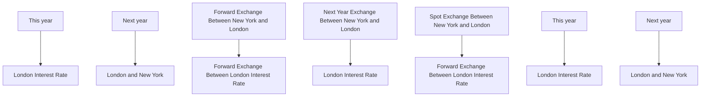

TIME PREFERENCE (IMPATIENCE)   

flowchart

CHART 4   
Interest Rates Between Different Years Comparable With Exchange Rates Between Different places.

All problems of local prices, exchange, and interest, act and react on each other in many ways. The problem of "time" foreign exchange, or forward foreign exchange, is indicated by the diagonals, and involves both interest and foreign exchange, i.e., both a time to time factor and a place to place factor combined in the same transaction. Both exchange and interest rates, as well as local prices, would be, theoretically, combined if, say, present New York wheat were quoted in terms of future London coal.

In this book, for simplicity, the problems of price determinations, in one place and at one time, are supposed to have been solved. $^{5}$ We start with the values of the

"For a statement of the theory of valuation in general, see Walras, Éléments d'Économie Politique Pure; Pareto, Cours d'Économie Politique; also, Manuel d'Économie Politique.

# THE THEORY OF INTEREST

items in the income stream ready made. Likewise we neglect the problem of foreign exchange; we are studying only the problem of interest.

# §5. Specifications of Income

In the above schematic picture only two periods of time are represented. In actual life there are many periods—an indefinite number of them. Theoretically there might be a rate of interest connecting every pair of possible dates. For instance, there might be a rate of interest between the present and one year hence, another between one year hence and two years hence, and so on, all these rates being quotable in today's markets. In practice no rates are actually quoted except those connecting the present (which, of course, merely means a future date near the present) with several more remotely future dates. A rate on a five year contract may be considered as a sort of an average of five theoretically existing rates, one for each of the five years covered.

Except when the contrary is specifically mentioned, it will henceforth be understood, for the sake of simplicity, that there is only one rate of interest, the rate of interest, applicable to all time intervals. This may be most conveniently pictured to mean the rate connecting today with one year hence. Even this rate of interest connecting two specific dates separated by one year depends on (or, in technical terminology, is a function of) conditions not only at these two dates but at many other dates. When it is said that the impatience of an individual depends on his future income stream, it is meant that the degree of his impatience for, say, \$100 worth of this year's income over \$100 worth of next year's income depends upon the entire character of his expected income

# TIME PREFERENCE (IMPATIENCE)

stream pictured as beginning today and extending into the indefinite future, with specific increases or decreases at different periods of time.

If we wish to be still more meticulous, we may note that a person's income stream is made up of a large number of different elements, filaments, strands, or fibers, some of which represent nourishment, others shelter, others amusement, and so on—all the components of real income. In a complete enumeration of these elements, we should need to distinguish the use of each different kind of food, and the gratification of every other variety of human want. Each of these constitutes a particular thread of the income stream, extending out from the present into the indefinite future, and varying at different points of time in respect to size and probability of attainment. A person's time preference, or impatience for income, therefore, depends theoretically on the size, time shape, and probability (as looked at in the present) of this entire collection of income elements as we may picture them stretching out into the entire future.

In summary, we may say then that an individual's impatience depends on the following four characteristics of his income stream:

1. The size (measured in dollars) of his expected real income stream.

2. Its expected distribution in time, or its time shape—that is, whether it is constant, or increasing, or decreasing, or sometimes one and sometimes the other.

3. Its composition—to what extent it consists of nourishment, of shelter, of amusement, of education, and so on.

4. Its probability, or degree of risk or uncertainty.

We shall consider these four in order.

# THE THEORY OF INTEREST

# §6. The Influence of Mere Size

Our first step, then, is to show how a person's impatience depends on the size of his income, assuming the other three conditions to remain constant; for, evidently, it is possible that two incomes may have the same time shape, composition and risk, and yet differ in size, one being, say, twice the other in every period of time.

In general, it may be said that, other things being equal, the smaller the income, the higher the preference for present over future income; that is, the greater the impatience to acquire income as early as possible. It is true, of course, that a permanently small income implies a keen appreciation of future wants as well as of immediate wants. Poverty bears down heavily on all portions of a man's expected life. But it increases the want for immediate income even more than it increases the want for future income.

This influence of poverty is partly rational, because of the importance, by supplying present needs, of keeping up the continuity of life and thus maintaining the ability to cope with the future; and partly irrational, because the pressure of present needs blinds a person to the needs of the future.

As to the rational aspect, present income is absolutely indispensable, not only for present needs, but even as a pre-condition to the attainment of future income. A man must live. Any one who values his life would, under ordinary circumstances, prefer to rob the future for the benefit of the present—so far, at least, as to keep life going. If a person has only one loaf of bread he would not set it aside for next year even if the rate of interest were 1000 per cent; for if he did so, he would starve in

# TIME PREFERENCE (IMPATIENCE)

the meantime. A single break in the thread of life suffices to cut off all the future. We stress the importance of the present because the present is the gateway to the future. Not only is a certain minimum of present income necessary to prevent starvation, but the nearer this minimum is approached the more precious does present income appear relative to future income.

As to the irrational aspect of the matter, the effect of poverty is often to relax foresight and self-control and to tempt us to “trust to luck” for the future, if only the all-engrossing need of present necessities can be satisfied.

We see, then, that a small income, other things being equal, tends to produce a high rate of impatience, partly from the thought that provision for the present is necessary both for the present itself and for the future as well, and partly from lack of foresight and self-control.

# §7. The Influence of Time Shape

The concept of time shape of the income stream $^{6}$ is best treated not apart from size but as combined with size and thus will constitute a complete specification of the size at each successive period of time. Types of income of different time shapes are shown on the charts in Chapter I. Uniform income is represented in Chart 1; increasing income in Chart 2; decreasing income in Chart 3. Fluctuating income is represented in both Charts 2 and 3.

The fact that a person's income is increasing tends to make his preference for present over future income high, as compared with what it would be if his income were flowing uniformly or at a slackening rate; for an increasing income means that the present income is relatively

\* Cf. Landry, L'Intérêt du Capital, Chapter X, § 149, pp. 311-315; §150, pp. 315-317.

# THE THEORY OF INTEREST

scarce and future income relatively abundant. A man who is now enjoying an income of only \$5000 a year, but who expects in ten years to be enjoying one of \$10,000 a year, will today prize a dollar in hand far more than the prospect of a dollar due ten years hence. His great expectations make him impatient to realize on them in advance. He may, in fact, borrow money to eke out this year's income and promise repayments out of his supposedly more abundant income ten years later. On the other hand, a progressively dwindling income, one such that present income is relatively abundant and future income relatively scarce, tends to appease impatience—i.e., to reduce the want for present as compared with that for future income. A man who has a salary of \$10,000 at present but expects to retire in a few years on half pay will not have a very high rate of preference for present over future income. He may even want to save from his present abundance in order to provide for coming needs.

These are, of course, only some of the various effects which various time shapes have on time preference. The important point is that it does make a difference to a man's time preference whether his income has one time shape or another, just as it makes a difference whether his income is, as a whole, larger or smaller.

The extent of these effects will, of course, vary greatly with different individuals. If two persons both have exactly the same sort of ascending income, one may have a rate of time preference, or degree of impatience, indicated by 10 per cent, while the other may have one of only 4 per cent. What we need to emphasize here is merely that, if for either man a descending income were substituted for an ascending income, he would experience a reduction of impatience; the first individual's might fall

# TIME PREFERENCE (IMPATIENCE)

from 10 to 7 per cent, and the second's from, say, 4 to 3 per cent.

If, now, we consider the combined effect on time preference of both the size and the time shape of income, we shall observe that those with small incomes are much more sensitive to time shape in their feeling of impatience than are those with larger incomes. For a poor man, a very slight stinting of the present suffices to enhance enormously his impatience for present income; and oppositely, a very slight increase in his present income will suffice enormously to diminish that impatience. A rich man, on the other hand, presumably requires a relatively large variation in the comparative amounts of this year's and next year's income in order to suffer any material change in his time preference.

It will be clear to readers of Böhm-Bawerk that the dependence of time preference on the time shape of a person's income stream is practically identical with what he called the "first circumstance" making for the superiority of present over future goods:

"The first great cause of difference in value between present and future goods consists in the different circumstances of want and provision in present and future. . . . If a person is badly in want of certain goods, or of goods in general, while he has reason to hope that at a future period he will be better off, he will always value a given quantity of immediately available goods at a higher figure than the same quantity of future goods."

The only important difference between this statement and that here formulated is that in this book the “provision” has the definite meaning contained in the income concept.

It is only for completeness that I have included in the

$^{1}$ Böhm-Bawerk, The Positive Theory of Capital, p. 249.

# THE THEORY OF INTEREST

list of characteristics of income affecting interest the composition of the income. It recognizes the fact that, strictly speaking, a man's real income is not one simple homogeneous flow of money, but a mosaic or skein of threads of many heterogeneous elements of psychic experience. An income of \$5000 may comprise for one individual one set of enjoyable services, and for another, an entirely different set. The inhabitants of one country may have relatively more house shelter and less food in their real incomes than those of another. Those differences will have, theoretically, an influence in one direction or the other upon the time preference. Food being a prime necessity, a decrease of the proportion of food, or nourishment, even though total income remain the same, will have an effect upon the impatience similar to the effect of the diminution of total income.

For practical purposes, however, we may ordinarily neglect the characteristic of income called composition; for ordinarily any variation in the mere composition of family budgets will very seldom be sufficient to have any appreciable effect on the rate of interest.

Hereafter, therefore, all the elements of income will be considered as lumped together in a single sum of money value. Our picture of income henceforth may be considered as a flag or pennant without regard to stripes but seen as a whole, stretching out into the future. Each man's pennant has a definite width varying with the distance from the flagstaff.

# §8. The Influence of Risk

We come finally to the element of risk. Future income is always subject to some uncertainty, and this uncertainty must naturally have an influence on the rate of time pref-

# TIME PREFERENCE (IMPATIENCE)

erence, or degree of impatience, of its possessor. It is to be remembered that the degree of impatience is the percentage preference for \$1 certain of immediate income, over \$1, also certain, of income of one year hence, even if all the income except that dollar be uncertain. The influence of risk on time preference, therefore, means the influence of uncertainties in the anticipated income of an individual upon his relative valuation of present and future increments of income, both increments being certain.

The manner in which risk operates upon time preference will differ, among other things, according to the particular periods in the future to which the risk applies. If, as is very common, the possessor of income regards his immediately future income as fairly well assured, but fears for the safety or certainty of his income in a more remote period, he may be aroused to a high appreciation of the needs of that remote future and hence may feel forced to save out of his present relatively certain abundance in order to supplement his relatively uncertain income later on. He is likely to have a low degree of impatience for a certain dollar of immediate income as compared with a certain dollar added to a remoter uncertain income.

Such a type of income is, in fact, not uncommon. The remote future is usually less known than the immediate future, a fact which of itself means risk or uncertainty. The chance of disease, accident, disability, or death is always to be reckoned with; but under ordinary circumstances this risk is greater in the remote future than in the immediate future. As a result, uncertainty has a tendency to keep impatience down. This tendency is expressed in the phrase "to lay up for a rainy day." The greater the risk of rainy days in the future, the greater the

# THE THEORY OF INTEREST

impulse to provide for them at the expense of the present.

But sometimes the relative uncertainty is reversed, and immediate income is subject to higher risk than remote income. Such is the case in the midst of a war, in a strike, or other misfortune, believed to be temporary. Such is also the case when an individual is assured a permanent position with a salary after a certain date, but, in the meantime, must obtain a precarious subsistence. In these cases the effect of the risk element is to enhance the estimation in which immediate income is held.

Again, the risk, instead of applying especially to remote periods of time or especially to immediate periods, may apply to all periods alike. Such a general risk largely explains why salaries and wages, being relatively assured, are generally lower than the average earnings of those who take the risks incident to being their own employers. It also explains why the bondholder is content with a lower average return than the stockholder. The bondholder chooses fixed and certain income rather than a variable and uncertain one, even if the latter is, on the average, larger. In short, a risky income, if the risk applies evenly to all parts of the income stream, is equivalent to a low income. And, since a low income, as we have seen, tends to create a high impatience, risk, if distributed in time, uniformly or fairly so, tends to raise impatience.

It follows, then, that risk tends in some cases to increase and in others to decrease impatience, according to the time incidence of the risk. But there is a common principle in all these cases. Whether the result is a high or a low time preference, the primary fact is that the risk of losing the income in a particular period of time operates, in the eyes of most people, as a virtual impoverish-

# TIME PREFERENCE (IMPATIENCE)

ment of the income in that period, and hence increases the estimation in which a unit of certain income in that particular period is held. If that period is a remote one, the risk to which it is subject makes for a high regard for remote income; if it is the present (immediate future), the risk makes for a high regard for immediate income; if the risk applies to all periods of time alike, it acts as a virtual decrease of income all along the line.

There are, however, exceptional individuals of the gambler type in whom caution is absent or perverted. Upon these, risk will have quite the opposite effects. Some persons who like to take great speculative chances are likely to treat the future as though it were especially well endowed, and are willing to sacrifice a large amount of their exaggerated expectations for the sake of a relatively small addition to their present income. In other words, they will have a high degree of impatience. The same individuals, if receiving an income which is risky for all periods of time alike, might, contrary to the rule, have, as a result, a low instead of a high degree of impatience.

The income to which risk applies may be, of course, either the income from articles of capital external to man or the income from man himself, considered as an income producer. In the latter case, often called earned income, the risk of losing the income is the risk of death or invalidism. This risk—the uncertainty as to human life, health and income producing power—is somewhat different from the uncertainty of income flowing from objective capital: for the cessation of life not only causes a cessation of the income produced by the dying human machine, but also a cessation of the enjoyment of all income whatsoever—or rather a transfer of the enjoyment

# THE THEORY OF INTEREST

to posterity of any income continuing after death. This is because the individual is in the double capacity of being at once a producer and a consumer.

The effect of risk, therefore, is manifold, according to the degree and range of application of risk to various periods of times. It also depends on whether or not the risk relates to the continuation of life; and if so, according to whether or not the individual's interest in the future extends beyond his own lifetime. The manner in which these various tendencies operate upon the rate of interest will be discussed in Chapter IX.

# §9. The Personal Factor

The proposition that, in the theory of interest, the impatience of a person for income depends upon the character of his income—as to its size, time shape, and probability—does not deny that it may depend on other factors also, just as, in the theory of prices, the proposition that the marginal want for an article depends upon the quantity of that article does not deny that it may depend on other elements as well.

But the dependence of impatience on income is of chief importance; for impatience, whatever else it depends on, is always impatience for income—exactly as the dependence of the marginal want for bread on the quantity of bread is more important than the dependence of this marginal want for bread on the quantity of some other commodity, such as butter. $^{8}$

We have seen, therefore, how a given man's impatience

\*For a theoretical discussion of marginal want as a function of various factors, see my Mathematical Investigations in the Theory of Value and Prices. For a mathematical formulation of impatience as a function of successive installments of income, see Appendix to this chapter, §7. See also Pareto, Manuel d'Économie Politique, p. 546 et seq.

# TIME PREFERENCE (IMPATIENCE)

depends both upon the characteristics of his expected income stream, and on his own personal characteristics. The rate of impatience which corresponds to a specific income stream will not be the same for everybody. This has already been noted, incidentally, but requires special discussion here. One man may have an annual rate of time preference of 6 per cent, and another 10 per cent, although both have the same income. Impatience differs with different persons for the same income and with different incomes for the same person. The personal differences are caused by differences in at least six personal characteristics $^{9}$ : (1) foresight, (2) self-control, (3) habit, (4) expectation of life, (5) concern for the lives of other persons, (6) fashion.

(1) Generally speaking, the greater the foresight, the less the impatience, and vice versa. $^{10}$ In the case of primitive races, children, and other uninstructed groups in society, the future is seldom considered in its true proportions. This is illustrated by the story of the farmer

\* Cf. Rae, Sociological Theory of Capital, p. 54; Böhm-Bawerk, The Positive Theory of Capital, Book V, Chapter III.

$^{10}$ To be exact, however, we should observe that lack of foresight may either increase or decrease time preference. Although most persons who lack foresight err by failing to give due weight to the importance of future needs, or, what amounts to the same thing, by estimating overconfidently the provision existing for such future needs, cases are to be found in which the opposite error is committed; that is, the individual exaggerates the needs of the future or underestimates the provision likely to be available for them. Such people stint themselves needlessly, even impairing health by insufficient food in their efforts to save for the dreaded future. Their lack of foresight in this case errs in underestimating instead of overestimating future income and so makes them too patient instead of too impatient. But in order not to complicate the text, only the former and more common error will be hereafter referred to when lack of foresight is mentioned. The reader may, in each such case, readily add the possibility of the contrary error.

# THE THEORY OF INTEREST

who would never mend his leaky roof. When it rained he could not stop the leak, and when it did not rain there was no leak to be stopped! Among such persons, the preference for present gratification is powerful because their anticipation of the future is weak. In regard to foresight, Rae states: $^{11}$

"The actual presence of the immediate object of desire in the mind, by exciting the attention, seems to rouse all the faculties, as it were, to fix their view on it, and leads them to a very lively conception of the enjoyments which it offers to their instant possession. The prospects of a future good, which future years may hold out to us, seem at such a moment dull and dubious, and are apt to be slighted, for objects on which the daylight is falling strongly, and showing us in all their freshness just within our grasp. There is no man, perhaps, to whom a good to be enjoyed to-day, would not seem of very different importance, from one exactly similar to be enjoyed twelve years hence, even though the arrival of both were equally certain."

The sagacious business man represents the other extreme; he is constantly forecasting. Many great corporations, banks, and investment trusts today maintain statistical departments largely for the purpose of gauging the future developments of business. The carefully calculated forecasts made by these and independent services tend to reduce the element of risk, and to aid intelligent speculation.

Differences in degrees of foresight and forecasting ability produce corresponding differences in the dependence of time preference on the character of income. Thus, for a given income, say \$5000 a year indefinitely, the reckless might have a degree of impatience or rate of time preference of 10 per cent, when the forehanded would experience a preference of only 5 per cent. In both cases,

# TIME PREFERENCE (IMPATIENCE)

the preference depends on the size, time shape, and risk of the income; but the particular rates corresponding to a particular income will be entirely different in the two cases. Therefore, the degree of impatience, in general, will tend to be higher in a community consisting of reckless individuals than in one consisting of the opposite type.

(2) Self-control, though distinct from foresight, is usually associated with it and has very similar effects. Foresight has to do with thinking; self-control, with willing. Though a weak will usually goes with a weak intellect, this is not necessarily so, nor always. The effect of a weak will is similar to the effect of inferior foresight. Like those workingmen who, before prohibition, could not resist the lure of the saloon on the way home Saturday night, many persons cannot deny themselves a present indulgence, even when they know what the consequences will be. Others, on the contrary, have no difficulty in stinting themselves in the face of all temptations.

(3) The third characteristic of human nature which needs to be considered is the tendency to follow grooves of habit. The influence of habit may be in either direction. Rich men's sons, accustomed to the enjoyment of a large income, are likely to put a higher valuation on present compared with future income than would persons possessing the same income but brought up under different conditions. When those habituated to luxury suffer a reverse of fortune they often find it harder to live moderately than do those of equal means who have risen instead of fallen in the economic scale; and this will be true even if foresight and self-control are inherently the same in the two cases. The former, brought up in the lap of luxury, will be more likely to be the prodigal son,

# THE THEORY OF INTEREST

that is, the more impatient for present income. The lack of such traditions among the Negroes tends toward a high rate of impatience, while the traditions of thrift among the Scotch curb impatience.

Our thrift campaigns are designed to reduce impatience by cultivating certain habits of regular saving out of income. So also is the propaganda for life insurance with its high-pressure salesmanship. On the other hand, the corresponding salesmanship for installment buying tends, in the first instance, in the opposite direction. The individual can indulge himself in the immediate enjoyment of a radio or an auto. Yet, it must not be overlooked that, after the sale is made, there ensues a new responsibility to provide for the future payments agreed upon which may permanently improve the faculties of foresight and self-control.

(4) The fourth personal circumstance which may influence impatience for immediate real income has to do with the uncertainty of life of the recipient. We have already seen, in a somewhat different connection, that the time preference of an individual will be affected by the prospect of a long or short life, both because the termination of life brings the termination of the income from labor, and because it also terminates the person's enjoyment of all income.

It is the latter fact in which we are interested here—the manner in which the expectation of life of a person affects the dependence of impatience on his income. There will be differences among different classes, different individuals, and different ages of the same individual. The chance of death may be said to be the most important rational factor tending to increase impatience; anything that would tend to prolong human life would

# TIME PREFERENCE (IMPATIENCE)

tend, at the same time, to reduce impatience. Rae goes so far as to say: $^{12}$

"Were life to endure forever, were the capacity to enjoy in perfection all its goods, both mental and corporeal, to be prolonged with it, and were we guided solely by the dictates of reason, there could be no limit to the formation of means for future gratification, till our utmost wishes were supplied. A pleasure to be enjoyed, or a pain to be endured, fifty or a hundred years hence, would be considered deserving the same attention as if it were to befall us fifty or a hundred minutes hence, and the sacrifice of a smaller present good, for a greater future good, would be readily made, to whatever period that futurity might extend. But life, and the power to enjoy it, are the most uncertain of all things, and we are not guided altogether by reason. We know not the period when death may come upon us, but we know that it may come in a few days, and must come in a few years. Why then be providing goods that cannot be enjoyed until times, which, though not very remote, may never come to us, or until times still more remote, and which we are convinced we shall never see? If life, too, is of uncertain duration and the time that death comes between us and all our possessions unknown, the approaches of old age are at least certain, and are dulling, day by day, the relish of every pleasure."

The shortness of life thus tends powerfully to increase the degree of impatience, or rate of time preference, beyond what it would otherwise be. This is especially evident when the income streams compared are long. A lover of music will be impatient for a piano, i.e., will prefer a piano at once to a piano available next year, because, since either will outlast his own life, he will get one more year's use out of a piano available at once.

(5) But whereas the shortness and uncertainty of life tend to increase impatience, their effect is greatly mitigated by the fifth circumstance, solicitude for the welfare of one's heirs. Probably the most powerful cause tending

# THE THEORY OF INTEREST

to reduce the rate of interest is the love of one's children and the desire to provide for their good. Wherever these sentiments decay, as they did at the time of the decline and fall of the Roman Empire, and it becomes the fashion to exhaust wealth in self-indulgence and leave little or nothing to offspring, impatience and the rate of interest will tend to be high. At such times the motto, "After us the deluge," indicates the feverish desire to squander in the present, at whatever cost to the future. $^{13}$

On the other hand, in a country like the United States, where parents regard their lives as continuing after death in the lives of their children, there exists a high appreciation of the needs of the future. This tends to produce a low degree of impatience. For persons with children, the prospect of loss of earnings through death only spurs them all the more to lay up for that rainy day in the family. For them the risk of loss of income through death is not very different from the risk of cessation of income from any ordinary investment; in such a case the risk of cessation of future income through death tends to lower their impatience for income. This act supplies the motive for life insurance. A man with a wife and children is willing to pay a high insurance premium in order that they may continue to enjoy an income after his death. This is partly responsible for the enormous extension of life insurance. At present in the United States the insurance on lives amounts to over \$100,000,000,000. This represents, for the most part, an investment of the present generation for the next.

An unmarried man, on the other hand, or a man who cares only for self-indulgence and does not care for pos-

# TIME PREFERENCE (IMPATIENCE)

terity, a man, in short, who wishes to “make the day and the journey alike,” will not try thus to continue the income after his death. In such a case uncertainty of life is especially calculated to produce a high rate of time preference. Sailors, especially unmarried sailors, offer the classic example. They are natural spendthrifts, and when they have money use it lavishly. The risk of shipwreck is always before them, and their motto is, “A short life and a merry one.” The same is even more true of the unmarried soldier. For such people the risk of cessation of life increases their impatience, since there is little future to be patient for.

Not only does regard for one's offspring lower impatience, but the increase of offspring has in part the same effect. So far as it adds to future needs rather than to immediate needs, it operates, like a descending income stream, to diminish impatience. Parents with growing families often feel the importance of providing for future years far more than parents in similar circumstances but with small families. They try harder to save and to take out life insurance; in other words, they are less impatient. Consequently, an increase of the average size of family would, other things being equal, reduce the rate of interest.

This proposition does not, of course, conflict with the converse proposition that the same prudent regard for the future which is created by the responsibilities of parenthood itself tends to diminish the number of offspring. Hence it is that the thrifty Frenchman and Dutchman have small families.

(6) The most fitful of the causes at work is probably fashion. This at the present time acts, on the one hand, to stimulate men to save and become millionaires, and,

# THE THEORY OF INTEREST

on the other hand, to stimulate millionaires to live in an ostentatious manner. Fashion is one of those potent yet illusory social forces which follow the laws of imitation so much emphasized by Tarde, $^{14}$ Le Bon, $^{15}$ Baldwin, $^{16}$ and other writers. In whatever direction the leaders of fashion first chance to move, the crowd will follow in mad pursuit until almost the whole social body will be moving in that direction. Sometimes the fashion becomes rigid, as in China, a fact emphasized by Bagehot; $^{17}$ and sometimes the effect of a too universal following is to stimulate the leaders to throw off their pursuers by taking some novel direction—which explains the constant vagaries of fashion in dress. Economic fashions may belong to either of these two groups—the fixed or the erratic. Examples of both are given by John Rae. $^{18}$ It is of vast importance to a community, in its influence both on the rate of interest and on the distribution of wealth itself, what direction fashion happens to take. For instance, should it become an established custom for millionaires to consider it “disgraceful to die rich,” as Carnegie expressed it, and believe it de rigueur to give the bulk of their fortunes for endowing universities, libraries, hospitals, or other public institutions, the effect would be, through diffusion of benefits, to lessen the disparities in

$^{34}$ Tarde, G. Social Laws. English translation. New York, Macmillan and Co., 1899. Also Les Louis de l'Imitation. Paris, Germer Baillière et C., 1895.   
$^{25}$ The Psychology of Socialism. English translation. London, T. Fisher Unwin, 1899. Also The Crowd.   
$^{36}$ Social and Ethical Interpretations in Mental Development. New York, Macmillan and Co., 1906.   
$^{37}$ Bagehot, Walter. Physics and Politics. New York, D. Appleton and Co., 1873, Chapter III.   
$^{18}$ See The Sociological Theory of Capital, Appendix, Article 1, pp. 245-276.

# TIME PREFERENCE (IMPATIENCE)

the distribution of wealth, and also to lower the rate of interest.

# §10. The Personal Factor Summarized

Impatience for income, therefore, depends for each individual on his income, on its size, time shape, and probability; but the particular form of this dependence differs according to the various characteristics of the individual. The characteristics which will tend to make his impatience great are: (1) short-sightedness, (2) a weak will, (3) the habit of spending freely, (4) emphasis upon the shortness and uncertainty of his life, (5) selfishness, or the absence of any desire to provide for his survivors, (6) slavish following of the whims of fashion. The reverse conditions will tend to lessen his impatience; namely, (1) a high degree of foresight, which enables him to give to the future such attention as it deserves; (2) a high degree of self-control, which enables him to abstain from present real income in order to increase future real income; (3) the habit of thrift; (4) emphasis upon the expectation of a long life; (5) the possession of a family and a high regard for their welfare after his death; (6) the independence to maintain a proper balance between outgo and income, regardless of Mrs. Grundy and the high-powered salesmen of devices that are useless or harmful, or which commit the purchaser beyond his income prospects.

The resultant of these various tendencies in any one individual will determine the degree of his impatience at a given time, under given conditions with a particular income stream. The result will differ as between individuals, and at different times for the same individual.

The same individual in the course of his life may

# THE THEORY OF INTEREST

change from one extreme of impatience to the other. Such an alteration may be caused by a change in the person's nature (as when a spendthrift is reformed or a man, originally prudent, becomes, through intemperance, reckless and thriftless), or by variation in his income, whether in respect to size, distribution in time, or uncertainty. Everyone at some time in his life doubtless changes his degree of impatience for income. In the course of an ordinary lifetime the changes in a man's degree of impatience are probably of the following general character: as a child he will have a high degree of impatience because of his lack of foresight and self-control; when he reaches the age of young manhood he may still have a high degree of impatience, but for a different reason, namely, because he then expects a large future income. He expects to get on in the world, and he will have a high degree of impatience because of the relative abundance of the imagined future as compared with the realized present. When he gets a little further along, and has a family, the result may be a low degree of impatience, because then the needs of the future rather than its endowment will appeal to him. He will not think that he is going to be so very rich; on the contrary, he will wonder how he is going to get along with so many mouths to feed. He looks forward to the future expenses of his wife and children with the idea of providing for them—an idea which makes for a high relative regard for the future and a low relative regard for the present. Then when he gets a little older, if his children are married and have gone out into the world and are well able to take care of themselves, he may again have a high degree of impatience for income, because he expects to die, and he thinks, "Instead of piling up for the remote future, why

# TIME PREFERENCE (IMPATIENCE)

shouldn't I enjoy myself during the few years that remain?"

§11. Income Rather Than Capital in the Leading Rôle

The essential fact, however, is that for any given individual at any given time, his impatience depends in a definite manner upon the size, time shape, and probability of his income stream.

This view, that the degree of impatience and, consequently, the rate of interest depend upon income, needs to be contrasted with the common view, which makes the rate of interest depend merely on the scarcity or abundance of capital. It is commonly believed that where capital is scarce, interest is high, and where capital is plentiful, interest is low. In a general way, there is undoubtedly some truth in this belief; and yet it contains a misinterpretation of borrowing and lending.

In the first place, we must distinguish between capital wealth and capital value. It is capital value of which most people think when they say capital. But capital value is merely capitalized income. Behind, or rather beyond, a capital of \$100,000 is the stream of income which that capital represents, or rather the choice of any one among many possible streams. To fix attention on the \$100,000 capital instead of on the income which is capitalized is to use the capital as a cloak to cover up the real factor in the case.

Moreover, capital value is itself dependent on a pre-existing rate of interest. As we know, the capital value of a farm will be doubled if the rate of interest is halved. In such a case there would seem to be more capital in farms than before; for the farms in a community would rise, say, from \$100,000,000 to \$200,000,000. But it is not

# THE THEORY OF INTEREST

the rise in capital value which produces this fall in interest. On the contrary, it is the fall in the interest rate which produces the rise in the capital. If we attempt to make the rate of interest depend on capital value, then, since capital value depends on two factors—the prospective income and the rate of interest—we thereby make the interest rate depend partly on income and partly on itself. The dependence on itself is of course nugatory, and we are brought back to its dependence on income as the only fact of real significance. It is present and future income that are traded against each other.

But, even as thus amended and explained, (that capital stands for income) the proposition that the rate of interest depends on the amount of capital is not satisfactory. For the mere amount of capital does not tell us enough about the income for which the capital stands. To know that one man has a capital worth \$10,000,000 and another has a capital worth \$20,000,000 shows, to be sure, that the latter man can have an income of double the value of the former; but it tells us absolutely nothing as to the time shapes of the two incomes actually selected; and the time shape of income has, as we have seen, a most profound influence on the time preference of its possessor, and time preference is a prime determiner of interest.

To illustrate this important fact, let us suppose that two communities differ in the amount of capital and the character of the income which that capital represents but, as far as possible, are similar in all other respects. One of these two communities we shall suppose has a capital of \$100,000,000, invested, as in Nevada, in mines and quarries nearly exhausted, while in the other community there is \$200,000,000 of capital invested in young orchards and forests, as in Florida. According to the theory

# TIME PREFERENCE (IMPATIENCE)

that abundance of capital makes interest low, we should expect the Nevada community to have a high rate of interest compared with the Florida community. This would ordinarily be true if the two communities had income streams differing only in size with the same time shapes and probabilities. But, under our assumptions, it is evident that, unless other circumstances should interfere, the opposite would be the case; for Nevada, due to the progressive exhaustion of her mines, is faced by a decreasing future income, and in order to offset the depreciation of capital which follows from this condition, $^{19}$ she would be seeking to lend or invest part of the income of the present or immediate future, in the hope of offsetting the decreased product of the mines in the more remote future. The Florida planters, on the contrary, would be inclined to borrow against their future crops. If the two communities are supposed to be commercially connected, it would be Nevada which would lend to Florida notwithstanding the fact that the lending community was the poorer in capital of the two. From this illustration it is clear that the mere amount of capital value is not only a misleading but a very inadequate criterion of the rate of interest. $^{20}$

Apologists for the common idea that abundance or scarcity of capital lowers or raises interest might be inclined to argue that it is not the total capital, but only the loanable capital which should be included, and that the Nevada community had more loanable capital than the Florida community. But the phrase loanable capital is merely another cloak to cover the fact that it is not the