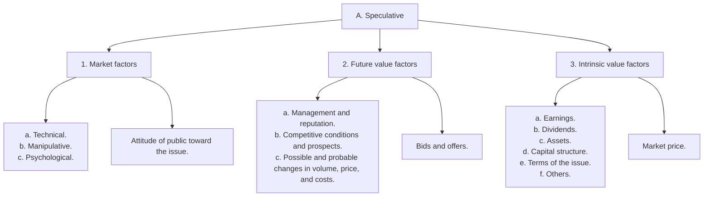

with the performance of the economy much as General Motors' did in earlier eras. Indeed, Intel has been around for far longer than GM had been when Graham and Dodd were writing this book.

In estimating future earnings (for any sort of business), Security Analysis provides two vital rules. One, as noted, is that companies with stable earnings are easier to forecast and hence preferable. The world having become more changeable, this precept might be modestly updated, to wit: the more volatile a firm's earnings, the more cautious one should be in estimating its future and the further back into its past one should look. Graham and Dodd suggested 10 years.

The second point relates to the tendency of earnings to fluctuate, at least somewhat, in a cyclical pattern. Therefore, Graham and Dodd made a vital (and oft-overlooked) distinction. A firm's average earnings can provide a rough guide to the future; the earnings trend is far less reliable. Any baseball fan knows that just because a .250 hitter hits .300 for a week, it cannot be assumed that he will necessarily hit that well for the rest of the season. And even if he does, the odds are he will revert to form the next year. But investors get seduced by the trend; perhaps they want to be seduced, for as Graham and Dodd observed, "Trends carried far enough into the future will yield any desired result."

To understand the distinction between the average and the trend, let's look at the earnings per share of Microsoft over the last half of the 1990s. (Each year is for the 12-month period ended in June.)

<table><tr><td>1995</td><td>$0.16</td></tr><tr><td>1996</td><td>$0.23</td></tr><tr><td>1997</td><td>$0.36</td></tr><tr><td>1998</td><td>$0.46</td></tr><tr><td>1999</td><td>$0.77</td></tr><tr><td>2000</td><td>$0.91</td></tr></table>

Although the average for the period is 48 cents, the more recent numbers are higher, and the upward trend is unmistakable. Projecting the trend into the future, a casual analyst at the turn of the century might have penciled in numbers like this:

\$1.10

\$1.30

\$1.55

Give or take a few pennies, this is exactly what so-called analysts were doing. Early in 2000, the stock was trading above \$50, based on the expectation that earnings would continue to soar. But 2000 was the peak of the cycle for ordering new computers. As new orders fell, Microsoft's earnings plummeted. In 2001, it earned 72 cents. The next year, it earned only 50 cents, virtually equal to its average for the mid-1990s. The stock plunged into the low \$20s.

Microsoft, however, was not some Internet fly-by-night. Over 20 years, it has always been profitable, and aside from the 2001–2002 cyclical slump, its earnings have steadily increased. Investors arguably overreacted to the slump much as, in the past, they overreacted to favorable news. They became fearful that Google might invade Microsoft's turf, though this concern was highly speculative. Microsoft continued to dominate operating software (indeed, it has had a virtual monopoly in that business) and to generate a prodigious cash flow. Also, since it has little need for reinvestment, it is free to employ its cash as it chooses. (By contrast, an airline must continually reinvest in new planes.) In that sense, Microsoft is an inherently good business. By fiscal 2007, it was trading at a multiple of only 15 times earnings, well less than its intrinsic characteristics justified given the strength of the franchise. Once Wall Street reawakened to the fact, the stock quickly rose 50% from its low. This demonstrates the

continuing pas de deux of price and value. At a high price, Microsoft was a sheer speculation; at a low one, a sound investment.

The mention of cash flow points to an area in which Security Analysis is truly dated. In the 1930s, companies did not have to publish cash flow reports, and virtually none of them did. Today, detailed cash flow statements are required, and for serious investors they are indispensable. The income statement gives the company's accounting profit; the cash flow statement reports what happened to its money.

Companies that try to cook the books such as Enron or Waste Management can always dress up the earnings statement, at least for a while. But they can't manufacture cash. Thus, when the income statement and the cash flow statement start to diverge, it's a signal that something is amiss. At Sunbeam, the high-flying appliance company run by "Chainsaw" Al Dunlap, sales of blenders were reportedly (reported by the company, that is) going through the roof, but the cash flow wasn't. It turned out that Dunlap was engaged in a massive fraud. Though he sold the company, it collapsed soon after, and "Chainsaw" was sawed off by the SEC from ever again serving as an officer or director in a public company.

Similarly, when Lucent's stock was sky-high, it was not actually collecting cash for many of the phone systems it was delivering, in particular to customers in developing countries. It was, in effect, loaning them out pending payment. Though these "sales" were booked into earnings, once again, the cash flow statement didn't lie.

This is a mischief that Graham would have discovered because an uncollected item goes on the balance sheet as a receivable, and Graham was a fiend for reading balance sheets. Graham and Dodd paid more attention to the balance sheet, which records a moment in financial time, than to earnings and cash flow statements, which depict the change over a previous quarter or year, because such information was either not available or not very detailed. Even the requirement for quarterly earnings was new in 1940, and earnings statements did not come freighted, as they do today, with detailed footnotes and discussions of significant risks.

Graham supplemented the published financials (though they were his primary source) with a highly eclectic mix of trade and government publications. When researching a coal stock, he consulted reports of the U.S. Coal Commission; on autos, Cram's Auto Service. For contemporary investors, in most cases, published financials are both exhaustive and reliable. Also, today, industry data are more widely available.

An investor in U.S. securities thus faces a challenge unimaginable to Graham and Dodd. Where the latter suffered a paucity of information, investors today confront a surfeit. Company financials are denser, and the information on the Internet is, of course, unlimited—a worrisome fact given its uneven quality. The challenge is to weed out what is irrelevant, insignificant, or just plain wrong, or rather, to identify what in particular is important. This would have meant identifying cash flow issues at Lucent or subprime exposure in the case of WaMu before the stocks ran into trouble.

As a rule of thumb, investors should spend the bulk of their time on the disclosures of the security under study, and they should spend significant time on the reports of competitors. The point is not just to memorize the numbers but to understand them; as we have seen, both the balance sheet and the statement of cash flow will throw significant light on the number that Wall Street pays the most attention to, the reported earnings.

There cannot be an absolute recommendation regarding investors' sources because people learn in different ways. Walter Schloss, a Graham employee and later a famed investor in his own right, and his son and associate Edwin shared a single telephone so that neither would spend too much time talking on it. (The Schlosses worked in an office that has been compared to a closet.) Like the Schlosses, many investors work

best in teams. On the other hand, Buffett, who works in an unpretentious office in Omaha, is famously solitary. His partner, Charlie Munger, resides in Los Angeles, 1,500 miles west, and in a day-to-day sense, Buffett operates largely on his own. And while some investors rely strictly on the published financials, others do substantial legwork. Eddie Lampert, the hedge fund manager, visited dozens of outlets of auto-parts retailer AutoZone before he bought a controlling stake in it. This was Lampert's way of getting into his comfort zone.

# Information at a Premium

In general, the greater dispersion of public information today puts a premium on information that is exclusive. The most likely source of exclusive information (apologies to Schloss) is the telephone. Some mutual funds employ former journalists to ferret out investing “scoops.” They call former employees for a candid appraisal of management; they talk to suppliers and competitors. One mutual fund discovered that a just-named CEO of a prominent financial company had confessed to an associate that he was nervous about taking the job because he couldn’t read financial statements. The fund, which had been looking at the stock, immediately lost interest. Though not everyone has the resources to hire a private sleuth, some research is eminently affordable. An enterprising stockbroker kept tabs on one of his stocks, Jones Soda, by chatting up baristas at Starbucks, one of the outlets where Jones was sold. When they told him that Starbucks was dropping the brand, he sold the stock pronto. Also, there is a certain kind of conviction that can be gleaned only from hearing management answer unscripted questions. Be forewarned, though; some executives will lie.

Graham was particularly mistrustful of executives (he did not like to visit managements for this reason). He and Dodd warned that “objective tests of managerial ability are few." Just as it is difficult to apportion proper credit to a winning coach, it is hard to say how much of a company's success is attributable to the executives. Investors often ascribe to managerial prowess what could be the residue of favorable conditions (or simply of good luck). Coca-Cola's earnings were rising sharply in the early and mid-1990s, and the company's aggressively promotional CEO, Roberto Goizueta, was feted on the cover of Fortune. Goizueta was talented, but his talent was fully reflected in Coca-Cola's earnings, and the earnings were reflected in the price of the stock. Investors, however, went a further step, pushing the stock to a lofty 45 times earnings due to their faith in management to increase earnings. Graham and Dodd referred to this as "double-counting"—that is, investors buy the stock on the basis of their faith in management and then, seeing that the stock has risen, take it as additional proof of management's powers and bid the stock up further. In 1997, an analyst at Oppenheimer was so smitten by Goizueta, who died later that year, that he wrote that Coca-Cola had "absolute control over near-term results."⁵

Such faith was misplaced on three accounts. First, Goizueta's talent was already factored into the stock. Second, the notion that management had "absolute control" was a myth, as was demonstrated when growth tapered off. Third, to the extent it did have control, it was by "managing" Coca-Cola's earnings, with the aid of dubious accounting contrivances. For instance, Coca-Cola made a practice of selling stakes in bottling plants and booking the gains into operating earnings to make its numbers. The suggestion that Goizueta was a magically talented guru was a warning signal. Rather than prove that Goizueta had the power to levitate earnings in the future, it raised questions about the quality of

the earnings he had achieved in the past. As reality caught up with Coca-Cola, the stock went into a decadelong funk.

Such examples should demonstrate that investing is hardly less risky today than in Graham and Dodd's era, nor is the human spirit less vulnerable to temptation and error. The complexity of our markets has further enhanced the need for an investing guide that is straightforward, logical, detailed, and, most especially, prudent. This and no more was the authors' brief. Herewith Part I—a primer on intrinsic value, an exploration of investment as distinct from speculation, and an introduction to Graham and Dodd's approach, their philosophy, their stratagems and guidance, and their tools.

# Chapter 1

# THE SCOPE AND LIMITATIONS OF SECURITY ANALYSIS. THE CONCEPT OF INTRINSIC VALUE

ANALYSIS CONNOTES the careful study of available facts with the attempt to draw conclusions therefrom based on established principles and sound logic. It is part of the scientific method. But in applying analysis to the field of securities we encounter the serious obstacle that investment is by nature not an exact science. The same is true, however, of law and medicine, for here also both individual skill (art) and chance are important factors in determining success or failure. Nevertheless, in these professions analysis is not only useful but indispensable, so that the same should probably be true in the field of investment and possibly in that of speculation.

In the last three decades the prestige of security analysis in Wall Street has experienced both a brilliant rise and an ignominious fall—a history related but by no means parallel to the course of stock prices. The advance of security analysis proceeded uninterruptedly until about 1927, covering a long period in which increasing attention was paid on all sides to financial reports and statistical data. But the “new era” commencing in 1927 involved at bottom the abandonment of the analytical approach; and while emphasis was still seemingly placed on facts and figures, these were manipulated by a sort of pseudo-analysis to support the delusions of the period. The market collapse in October 1929 was no surprise to such analysts as had kept their heads, but the extent of the business collapse which later developed, with its devastating effects on established earning power, again threw their calculations out of gear. Hence the ultimate result was that serious analysis suffered a double discrediting: the first—prior to the crash—due to the persistence of imaginary values, and the second—after the crash—due to the disappearance of real values.

The experiences of 1927–1933 were of so extraordinary a character that they scarcely provide a valid criterion for judging the usefulness of security analysis. As to the years since 1933, there is perhaps room for a difference of opinion. In the field of bonds and preferred stocks, we believe that sound principles of selection and rejection have justified themselves quite well. In the common-stock arena the partialities of the market have tended to confound the conservative viewpoint, and conversely many issues appearing cheap under analysis have given a disappointing performance. On the other hand, the analytical approach would have given strong grounds for believing representative stock prices to be too high in early 1937 and too low a year later.

# THREE FUNCTIONS OF ANALYSIS: 1. DESCRIPTIVE FUNCTION

The functions of security analysis may be described under three headings: descriptive, selective, and critical. In its more obvious form, descriptive analysis consists of marshalling the important facts relating to an issue and presenting them in a coherent, readily intelligible manner. This function is adequately performed for the entire range of marketable corporate securities by the various manuals, the Standard Statistics and Fitch services, and others. A more penetrating type of description seeks to reveal the strong and weak points in the position of an issue, compare its exhibit with that of others of similar character, and appraise the factors which are likely to influence its future performance. Analysis of this kind is applicable to almost every corporate issue, and it may be regarded as an adjunct not only to investment but also to intelligent speculation in that it provides an organized factual basis for the application of judgment.

# 2. THE SELECTIVE FUNCTION OF SECURITY ANALYSIS

In its selective function, security analysis goes further and expresses specific judgments of its own. It seeks to determine whether a given issue should be bought, sold, retained, or exchanged for some other. What types of securities or situations lend themselves best to this more positive activity of the analyst, and to what handicaps or limitations is it subject? It may be well to start with a group of examples of analytical judgments, which could later serve as a basis for a more general inquiry.

Examples of Analytical Judgments. In 1928 the public was offered a large issue of $6\%$ noncumulative preferred stock of St. Louis-San Francisco Railway Company priced at 100. The record showed that in no year in the company's history had earnings been equivalent to as much as $1^{1/2}$ times the fixed charges and preferred dividends combined. The application of well-established standards of selection to the facts in this case would have led to the rejection of the issue as insufficiently protected.

A contrasting example: In June 1932 it was possible to purchase $5\%$ bonds of Owens-Illinois Glass Company, due 1939, at 70, yielding $11\%$ to maturity. The company's earnings were many times the interest requirements—not only on the average but even at that time of severe depression. The bond issue was amply covered by current assets alone, and it was followed by common and preferred stock with a very large aggregate market value, taking their lowest quotations. Here, analysis would have led to the recommendation of this issue as a strongly entrenched and attractively priced investment.

Let us take an example from the field of common stocks. In 1922, prior to the boom in aviation securities, Wright Aeronautical Corporation stock was selling on the New York Stock Exchange at only \$8, although it was paying a \$1 dividend, had for some time been earning over \$2 a share, and showed more than \$8 per share in cash assets in the treasury. In this case analysis would readily have established that the intrinsic value of the issue was substantially above the market price.

Again, consider the same issue in 1928 when it had advanced to \$280 per share. It was then earning at the rate of \$8 per share, as against \$3.77 in 1927. The dividend rate was \$2; the net-asset value was less than \$50 per share. A study of this picture must have shown conclusively that the market price represented for the most part the capitalization of entirely conjectural future prospects—in other words, that the intrinsic value was far less than the market quotation.

A third kind of analytical conclusion may be illustrated by a comparison of Interborough Rapid Transit Company First and Refunding 5s with the same company's Collateral 7% Notes, when both issues were selling at the same price (say 62) in 1933. The 7% notes were clearly worth considerably more than the 5s. Each \$1,000 note was secured by deposit of \$1,736 face amount of 5s; the principal of the notes had matured; they were entitled either to be paid off in full or to a sale of the collateral for their benefit. The annual interest received on the collateral was equal to about \$87 on each 7% note (which amount was actually being distributed to the note holders), so that the current income on the 7s was considerably greater than that on the 5s. Whatever technicalities might be invoked to prevent the note holders from asserting their contractual rights promptly and completely, it was difficult to imagine conditions under which the 7s would not be intrinsically worth considerably more than the 5s.

A more recent comparison of the same general type could have been drawn between Paramount Pictures First Convertible Preferred selling at 113 in October 1936 and the common stock concurrently selling at $15^{7/8}$ . The preferred stock was convertible at the holders' option into seven times as many shares of common, and it carried accumulated dividends of about \$11 per share. Obviously the preferred was cheaper than the common, since it would have to receive very substantial dividends before the common received anything, and it could also share fully in any rise of the common by reason of the conversion privilege. If a common stockholder had accepted this analysis and exchanged his shares for one-seventh as many preferred, he would soon have realized a large gain both in dividends received and in principal value. $^{1}$

Intrinsic Value vs. Price. From the foregoing examples it will be seen that the work of the securities analyst is not without concrete results of considerable practical value, and that it is applicable to a wide variety of situations. In all of these instances he appears to be concerned with the intrinsic value of the security and more particularly with the discovery of discrepancies between the intrinsic value and the market price. We must recognize, however, that intrinsic value is an elusive concept. In general terms it is understood to be that value which is justified by the facts, e.g., the assets, earnings, dividends, definite prospects, as distinct, let us say, from market quotations established by artificial manipulation or distorted by psychological excesses. But it is a great mistake to imagine that intrinsic value is as definite and as determinable as is the market price. Some time ago intrinsic value (in the case of a common stock) was thought to be about the same thing as “book value,” i.e., it was equal to the net assets of the business, fairly priced. This view of intrinsic value was quite definite, but it proved almost worthless as a practical matter because neither the average earnings nor the average market price evinced any tendency to be governed by the book value.

Intrinsic Value and “Earning Power.” Hence this idea was superseded by a newer view, viz., that the intrinsic value of a business was determined by its earning power. But the phrase “earning power” must imply a fairly confident expectation of certain future results. It is not sufficient to know what the past earnings have averaged, or even that they disclose a definite line of growth or decline. There must be plausible grounds for believing that this average or this trend is a dependable guide to the future. Experience has shown only too forcibly that in many instances this is far from true. This means that the concept of “earning power,” expressed as a definite figure, and the derived concept of intrinsic value, as something equally definite and ascertainable, cannot be safely accepted as a general premise of security analysis.

Example: To make this reasoning clearer, let us consider a concrete and typical example. What would we mean by the intrinsic value of J. I. Case Company common, as analyzed, say, early in 1933? The market price was \$30; the asset value per share was \$176; no dividend was being paid; the average earnings for ten years had been \$9.50 per share; the results for 1932 had shown a deficit of \$17 per share. If we followed a customary method of appraisal, we might take the average earnings per share of common for ten years, multiply this average by ten, and arrive at an intrinsic value of \$95. But let us examine the individual figures which make up this ten-year average. They are as shown in the table on page 66. The average of \$9.50 is obviously nothing more than an arithmetical resultant from ten unrelated figures. It can hardly be urged that this average is in any way representative of typical conditions in the past or representative of what may be expected in the future. Hence any figure of “real” or intrinsic value derived from this average must be characterized as equally accidental or artificial. $^{2}$

EARNINGS PER SHARE OF J.I. CASE COMMON 

<table><tr><td>1932</td><td>$17.40(d)</td></tr><tr><td>1931</td><td>2.90(d)</td></tr><tr><td>1930</td><td>11.00</td></tr><tr><td>1929</td><td>20.40</td></tr><tr><td>1928</td><td>26.90</td></tr><tr><td>1927</td><td>26.00</td></tr><tr><td>1926</td><td>23.30</td></tr><tr><td>1925</td><td>15.30</td></tr><tr><td>1924</td><td>5.90(d)</td></tr><tr><td>1923</td><td>2.10(d)</td></tr><tr><td>Average</td><td>$9.50</td></tr></table>

(d) Deficit.

The Role of Intrinsic Value in the Work of the Analyst. Let us try to formulate a statement of the role of intrinsic value in the work of the analyst which will reconcile the rather conflicting implications of our various examples. The essential point is that security analysis does not seek to determine exactly what is the intrinsic value of a given security. It needs only to establish either that the value is adequate—e.g., to protect a bond or to justify a stock purchase—or else that the value is considerably higher or considerably lower than the market price. For such purposes an indefinite and approximate measure of the intrinsic value may be sufficient. To use a homely simile, it is quite possible to decide by inspection that a woman is old enough to vote without knowing her age or that a man is heavier than he should be without knowing his exact weight.

This statement of the case may be made clearer by a brief return to our examples. The rejection of St. Louis-San Francisco Preferred did not require an exact calculation of the intrinsic value of this railroad system. It was enough to show, very simply from the earnings record, that the margin of value above the bondholders' and preferred stockholders' claims was too small to assure safety. Exactly the opposite was true for the Owens-Illinois Glass 5s. In this instance, also, it would undoubtedly have been difficult to arrive at a fair valuation of the business; but it was quite easy to decide that this value in any event was far in excess of the company's debt.

In the Wright Aeronautical example, the earlier situation presented a set of facts which demonstrated that the business was worth substantially more than \$8 per share, or \$1,800,000. In the later year, the facts were equally conclusive that the business did not have a reasonable value of \$280 per share, or \$70,000,000 in all. It would have been difficult for the analyst to determine whether Wright Aeronautical was actually worth \$20 or \$40 a share in 1922—or actually worth \$50 or \$80 in 1929. But fortunately it was not necessary to decide these points in order to conclude that the shares were attractive at \$8 and unattractive, intrinsically, at \$280.

The J. I. Case example illustrates the far more typical common-stock situation, in which the analyst cannot reach a dependable conclusion as to the relation of intrinsic value to market price. But even here, if the price had been low or high enough, a conclusion might have been warranted. To express the uncertainty of the picture, we might say that it was difficult to determine in early 1933 whether the intrinsic value of Case common was nearer \$30 or \$130. Yet if the stock had been selling at as low as \$10, the analyst would undoubtedly have been justified in declaring that it was worth more than the market price.

Flexibility of the Concept of Intrinsic Value. This should indicate how flexible is the concept of intrinsic value as applied to security analysis. Our notion of the intrinsic value may be more or less distinct, depending on the particular case. The degree of indistinctness may be expressed by a very hypothetical “range of approximate value,” which would grow wider as the uncertainty of the picture increased, e.g., \$20 to \$40 for Wright Aeronautical in 1922 as against \$30 to \$130 for Case in 1933. It would follow that even a very indefinite idea of the intrinsic value may still justify a conclusion if the current price falls far outside either the maximum or minimum appraisal.

More Definite Concept in Special Cases. The Interborough Rapid Transit example permits a more precise line of reasoning than any of the others. Here a given market price for the 5% bonds results in a very definite valuation for the 7% notes. If it were certain that the collateral securing the notes would be acquired for and distributed to the note holders, then the mathematical relationship—viz., \$1,736 of value for the 7s against \$1,000 of value for the 5s—would eventually be established at this ratio in the market. But because of quasi-political complications in the picture, this normal procedure could not be expected with certainty. As a practical matter, therefore, it is not possible to say that the 7s are actually worth 74% more than the 5s, but it may be said with assurance that the 7s are worth substantially more—which is a very useful conclusion to arrive at when both issues are selling at the same price.

The Interborough issues are an example of a rather special group of situations in which analysis may reach more definite conclusions respecting intrinsic value than in the ordinary case. These situations may involve a liquidation or give rise to technical operations known as “arbitrage” or “hedging.” While, viewed in the abstract, they are probably the most satisfactory field for the analyst’s work, the fact that they are specialized in character and of infrequent occurrence makes them relatively unimportant from the broader standpoint of investment theory and practice.

Principal Obstacles to Success of the Analyst. a. Inadequate or Incorrect Data. Needless to say, the analyst cannot be right all the time. Furthermore, a conclusion may be logically right but work out badly in practice. The main obstacles to the success of the analyst's work are threefold, viz., (1) the inadequacy or incorrectness of the data, (2) the uncertainties of the future, and (3) the irrational behavior of the market. The first of these drawbacks, although serious, is the least important of the three. Deliberate falsification of the data is rare; most of the misrepresentation flows from the use of accounting artifices which it is the function of the capable analyst to detect. Concealment is more common than misstatement. But the extent of such concealment has been greatly reduced as the result of regulations, first of the New York Stock Exchange and later of the S.E.C., requiring more complete disclosure and fuller explanation of accounting practices. Where information on an important point is still withheld, the analyst's experience and skill should lead him to note this defect and make allowance therefor—if, indeed, he may not elicit the facts by proper inquiry and pressure. In some cases, no doubt, the concealment will elude detection and give rise to an incorrect conclusion.

b. Uncertainties of the Future. Of much greater moment is the element of future change. A conclusion warranted by the facts and by the apparent prospects may be vitiated by new developments. This raises the question of how far it is the function of security analysis to anticipate changed conditions. We shall defer consideration of this point until our discussion of various factors entering into the processes of analysis. It is manifest, however, that future changes are largely unpredictable, and that security analysis must ordinarily proceed on the assumption that the past record affords at least a rough guide to the future. The more questionable this assumption, the less valuable is the analysis. Hence this technique is more useful when applied to senior securities (which are protected against change) than to common stocks; more useful when applied to a business of inherently stable character than to one subject to wide variations; and, finally, more useful when carried on under fairly normal general conditions than in times of great uncertainty and radical change.

c. The Irrational Behavior of the Market. The third handicap to security analysis is found in the market itself. In a sense the market and the future present the same kind of difficulties. Neither can be predicted or controlled by the analyst, yet his success is largely dependent upon them both. The major activities of the investment analyst may be thought to have little or no concern with market prices. His typical function is the selection of high-grade, fixed-income-bearing bonds, which upon investigation he judges to be secure as to interest and principal. The purchaser is supposed to pay no attention to their subsequent market fluctuations, but to be interested solely in the question whether the bonds will continue to be sound investments. In our opinion this traditional view of the investor's attitude is inaccurate and somewhat hypocritical. Owners of securities, whatever their character, are interested in their market quotations. This fact is recognized by the emphasis always laid in investment practice upon marketability. If it is important that an issue be readily salable, it is still more important that it command a satisfactory price. While for obvious reasons the investor in high-grade bonds has a lesser concern with market fluctuations than has the speculator, they still have a strong psychological, if not financial, effect upon him. Even in this field, therefore, the analyst must take into account whatever influences may adversely govern the market price, as well as those which bear upon the basic safety of the issue.

In that portion of the analyst's activities which relates to the discovery of undervalued, and possibly of overvalued securities, he is more directly concerned with market prices. For here the vindication of his judgment must be found largely in the ultimate market action of the issue. This field of analytical work may be said to rest upon a twofold assumption: first, that the market price is frequently out of line with the true value; and, second, that there is an inherent tendency for these disparities to correct themselves. As to the truth of the former statement, there can be very little doubt—even though Wall Street often speaks glibly of the “infallible judgment of the market” and asserts that “a stock is worth what you can sell it for—neither more nor less.”

The Hazard of Tardy Adjustment of Price Value. The second assumption is equally true in theory, but its working out in practice is often most unsatisfactory. Undervaluations caused by neglect or prejudice may persist for an inconveniently long time, and the same applies to inflated prices caused by overenthusiasm or artificial stimulants. The particular danger to the analyst is that, because of such delay, new determining factors may supervene before the market price adjusts itself to the value as he found it. In other words, by the time the price finally does reflect the value, this value may have changed considerably and the facts and reasoning on which his decision was based may no longer be applicable.

The analyst must seek to guard himself against this danger as best he can: in part, by dealing with those situations preferably which are not subject to sudden change; in part, by favoring securities in which the popular interest is keen enough to promise a fairly swift response to value elements which he is the first to recognize; in part, by tempering his activities to the general financial situation—laying more emphasis on the discovery of undervalued securities when business and market conditions are on a fairly even keel, and proceeding with greater caution in times of abnormal stress and uncertainty.

The Relationship of Intrinsic Value to Market Price. The general question of the relation of intrinsic value to the market quotation may be made clearer by the following chart, which traces the various steps culminating in the market price. It will be evident from the chart that the influence of what we call analytical factors over the market price is both partial and indirect—partial, because it frequently competes with purely speculative factors which influence the price in the opposite direction; and indirect, because it acts through the intermediary of people's sentiments and decisions. In other words, the market is not a weighing machine, on which the value of each issue is recorded by an exact and impersonal mechanism, in accordance with its specific qualities. Rather should we say that the market is a voting machine, whereon countless individuals register choices which are the product partly of reason and partly of emotion.

# RELATIONSHIP OF INTRINSIC VALUE FACTORS TO MARKET PRICE

I. General market factors.   
II. Individual factors.

flowchart

# ANALYSIS AND SPECULATION

It may be thought that sound analysis should produce successful results in any type of situation, including the confessedly speculative, i.e., those subject to substantial uncertainty and risk. If the selection of speculative issues is based on expert study of the companies' position, should not this approach give the purchaser a considerable advantage? Admitting future events to be uncertain, could not the favorable and unfavorable developments be counted on to cancel out against each other, more or less, so that the initial advantage afforded by sound analysis will carry through into an eventual average profit? This is a plausible argument but a deceptive one; and its over-ready acceptance has done much to lead analysts astray. It is worth while, therefore, to detail several valid arguments against placing chief reliance upon analysis in speculative situations.

In the first place, what may be called the mechanics of speculation involves serious handicaps to the speculator, which may outweigh the benefits conferred by analytical study. These disadvantages include the payment of commissions and interest charges, the so-called “turn of the market” (meaning the spread between the bid and asked price), and, most important of all, an inherent tendency for the average loss to exceed the average profit, unless a certain technique of trading is followed, which is opposed to the analytical approach.

The second objection is that the underlying analytical factors in speculative situations are subject to swift and sudden revision. The danger, already referred to, that the intrinsic value may change before the market price reflects that value, is therefore much more serious in speculative than in investment situations. A third difficulty arises from circumstances surrounding the unknown factors, which are necessarily left out of security analysis. Theoretically these unknown factors should have an equal chance of being favorable or unfavorable, and thus they should neutralize each other in the long run. For example, it is often easy to determine by comparative analysis that one company is selling much lower than another in the same field, in relation to earnings, although both apparently have similar prospects. But it may well be that the low price for the apparently attractive issue is due to certain important unfavorable factors which, though not disclosed, are known to those identified with the company—and vice versa for the issue seemingly selling above its relative value. In speculative situations, those “on the inside” often have an advantage of this kind which nullifies the premise that good and bad changes in the picture should offset each other, and which loads the dice against the analyst working with some of the facts concealed from him. $^{3}$

The Value of Analysis Diminishes as the Element of Chance Increases. The final objection is based on more abstract grounds, but, nevertheless, its practical importance is very great. Even if we grant that analysis can give the speculator a mathematical advantage, it does not assure him a profit. His ventures remain hazardous; in any individual case a loss may be taken; and after the operation is concluded, it is difficult to determine whether the analyst's contribution has been a benefit or a detriment. Hence the latter's position in the speculative field is at best uncertain and somewhat lacking in professional dignity. It is as though the analyst and Dame Fortune were playing a duet on the speculative piano, with the fickle goddess calling all the tunes.

By another and less imaginative simile, we might more convincingly show why analysis is inherently better suited to investment than to speculative situation. (In anticipation of a more detailed inquiry in a later chapter, we have assumed throughout this chapter that investment implies expected safety and speculation connotes acknowledged risk.) In Monte Carlo the odds are weighted 19 to 18 in favor of the proprietor of the roulette wheel, so that on the average he wins one dollar out of each 37 wagered by the public. This may suggest the odds against the untrained investor or speculator. Let us assume that, through some equivalent of analysis, a roulette player is able to reverse the odds for a limited number of wagers, so that they are now 18 to 19 in his favor. If he distributes his wagers evenly over all the numbers, then whichever one turns up he is certain to win a moderate amount. This operation may be likened to an investment program based upon sound analysis and carried on under propitious general conditions.

But if the player wagers all his money on a single number, the small odds in his favor are of slight importance compared with the crucial question whether chance will elect the number he has chosen. His “analysis” will enable him to win a little more if he is lucky; it will be of no value when luck is against him. This, in slightly exaggerated form perhaps, describes the position of the analyst dealing with essentially speculative operations. Exactly the same mathematical advantage which practically assures good results in the investment field may prove entirely ineffective where luck is the overshadowing influence.

It would seem prudent, therefore, to consider analysis as an adjunct or auxiliary rather than as a guide in speculation. It is only where chance plays a subordinate role that the analyst can properly speak in an authoritative voice and accept responsibility for the results of his judgments.

# 3. THE CRITICAL FUNCTION OF SECURITY ANALYSIS

The principles of investment finance and the methods of corporation finance fall necessarily within the province of security analysis. Analytical judgments are reached by applying standards to facts. The analyst is concerned, therefore, with the soundness and practicability of the standards of selection. He is also interested to see that securities, especially bonds and preferred stocks, be issued with adequate protective provisions, and—more important still—that proper methods of enforcement of these covenants be part of accepted financial practice.

It is a matter of great moment to the analyst that the facts be fairly presented, and this means that he must be highly critical of accounting methods. Finally, he must concern himself with all corporate policies affecting the security owner, for the value of the issue which he analyzes may be largely dependent upon the acts of the management. In this category are included questions of capitalization set-up, of dividend and expansion policies, of managerial compensation, and even of continuing or liquidating an unprofitable business.

On these matters of varied import, security analysis may be competent to express critical judgments, looking to the avoidance of mistakes, to the correction of abuses, and to the better protection of those owning bonds or stocks.

# Chapter 2

# FUNDAMENTAL ELEMENTS IN THE PROBLEM OF ANALYSIS. QUANTITATIVE AND QUALITATIVE FACTORS

IN THE PREVIOUS chapter we referred to some of the concepts and materials of analysis from the standpoint of their bearing on what the analyst may hope to accomplish. Let us now imagine the analyst at work and ask what are the broad considerations which govern his approach to a particular problem, and also what should be his general attitude toward the various kinds of information with which he has to deal.

# FOUR FUNDAMENTAL ELEMENTS

The object of security analysis is to answer, or assist in answering, certain questions of a very practical nature. Of these, perhaps the most customary are the following: What securities should be bought for a given purpose? Should issue S be bought, or sold, or retained?

In all such questions, four major factors may be said to enter, either expressly or by implication. These are:

1. The security.   
2. The price.   
3. The time.   
4. The person.

More completely stated, the second typical question would run, Should security S be bought (or sold, or retained) at price P, at this time T, by individual I? Some discussion of the relative significance of these four factors is therefore pertinent, and we shall find it convenient to consider them in inverse order.

The Personal Element. The personal element enters to a greater or lesser extent into every security purchase. The aspect of chief importance is usually the financial position of the intending buyer. What might be an attractive speculation for a business man should under no circumstances be attempted by a trustee or a widow with limited income. Again, United States Liberty 3 $^{1/2}$ s should not have been purchased by those to whom their complete tax-exemption feature was of no benefit, when a considerably higher yield could be obtained from partially taxable governmental issues. $^{1}$

Other personal characteristics that on occasion might properly influence the individual's choice of securities are his financial training and competence, his temperament, and his preferences. But however vital these considerations may prove at times, they are not ordinarily determining factors in analysis. Most of the conclusions derived from analysis can be stated in impersonal terms, as applicable to investors or speculators as a class.

The Time. The time at which an issue is analyzed may affect the conclusion in various ways. The company's showing may be better, or its outlook may seem better, at one time than another, and these changing circumstances are bound to exert a varying influence on the analyst's viewpoint toward the issue. Furthermore, securities are selected by the application of standards of quality and yield, and both of these—particularly the latter—will vary with financial conditions in general. A railroad bond of highest grade yielding 5% seemed attractive in June 1931 because the average return on this type of bond was 4.32%. But the same offering made six months later would have been quite unattractive, for in the meantime bond prices had fallen severely and the yield on this group had increased to 5.86%. Finally, nearly all security commitments are influenced to some extent by the current view of the financial and business outlook. In speculative operations these considerations are of controlling importance; and while conservative investment is ordinarily supposed to disregard these elements, in times of stress and uncertainty they may not be ignored.

Security analysis, as a study, must necessarily concern itself as much as possible with principles and methods which are valid at all times—or, at least, under all ordinary conditions. It should be kept in mind, however, that the practical applications of analysis are made against a background largely colored by the changing times.

The Price. The price is an integral part of every complete judgment relating to securities. In the selection of prime investment bonds, the price is usually a subordinate factor, not because it is a matter of indifference but because in actual practice the price is rarely unreasonably high. Hence almost entire emphasis is placed on the question whether the issue is adequately secured. But in a special case, such as the purchase of high-grade convertible bonds, the price may be a factor fully as important as the degree of security. This point is illustrated by the American Telephone and Telegraph Company Convertible $4^{1/2}s$ , due 1939, which sold above 200 in 1929. The fact that principal (at par) and interest were safe beyond question did not prevent the issue from being an extremely risky purchase at that price—one which in fact was followed by the loss of over half its market value. $^{2}$

In the field of common stocks, the necessity of taking price into account is more compelling, because the danger of paying the wrong price is almost as great as that of buying the wrong issue. We shall point out later that the new-era theory of investment left price out of the reckoning, and that this omission was productive of most disastrous consequences.

The Security: Character of the Enterprise and the Terms of the Commitment. The roles played by the security and its price in an investment decision may be set forth more clearly if we restate the problem in somewhat different form. Instead of asking, (1) In what security? and (2) At what price? let us ask, (1) In what enterprise? and (2) On what terms is the commitment proposed? This gives us a more comprehensive and evenly balanced contrast between two basic elements in analysis. By the terms of the investment or speculation, we mean not only the price but also the provisions of the issue and its status or showing at the time.

<table><tr><td>Year</td><td>High</td><td>Low</td></tr><tr><td>1929</td><td>227</td><td>118</td></tr><tr><td>1930</td><td> $193^{3}/_{8}$ </td><td>116</td></tr><tr><td>1931</td><td>135</td><td>95</td></tr></table>

Example of Commitment on Unattractive Terms. An investment in the soundest type of enterprise may be made on unsound and unfavorable terms. Prior to 1929 the value of urban real estate had tended to grow steadily over a long period of years; hence it came to be regarded by many as the “safest” medium of investment. But the purchase of a preferred stock in a New York City real estate development in 1929 might have involved terms of investment so thoroughly disadvantageous as to banish all elements of soundness from the proposition. One such stock offering could be summarized as follows $^{3}$ :

1. Provisions of the Issue. A preferred stock, ranking junior to a large first mortgage and without unqualified rights to dividend or principal payments. It ranked ahead of a common stock which represented no cash investment so that the common stockholders had nothing to lose and a great deal to gain, while the preferred stockholders had everything to lose and only a small share in the possible gain.   
2. Status of the Issue. A commitment in a new building, constructed at an exceedingly high level of costs, with no reserves or junior capital to fall back upon in case of trouble.   
3. Price of the Issue. At par the dividend return was 6%, which was much less than the yield obtainable on real-estate second mortgages having many other advantages over this preferred stock. $^{4}$

Example of a Commitment on Attractive Terms. We have only to examine electric power and light financing in recent years to find countless examples of unsound securities in a fundamentally attractive industry. By way of contrast let us cite the case of Brooklyn Union

Elevated Railroad First 5s, due 1950, which sold in 1932 at 60 to yield 9.85% to maturity. They are an obligation of the Brooklyn-Manhattan Transit System. The traction, or electric railway, industry has long been unfavorably regarded, chiefly because of automobile competition but also on account of regulation and fare-contract difficulties. Hence this security represents a comparatively unattractive type of enterprise. Yet the terms of the investment here might well make it a satisfactory commitment, as shown by the following:

1. Provisions of the Issue. By contract between the operating company and the City of New York, this was a first charge on the earnings of the combined subway and elevated lines of the system, both company and city owned, representing an investment enormously greater than the size of this issue.   
2. Status of the Issue. Apart from the very exceptional specific protection just described, the bonds were obligations of a company with stable and apparently fully adequate earning power.   
3. Price of Issue. It could be purchased to yield somewhat more than the Brooklyn-Manhattan Transit Corporation 6s, due 1968, which occupied a subordinate position. (At the low price of 68 for the latter issue in 1932, its yield was 9% against 9.85% for the Brooklyn Union Elevated 5s. $^{4}$ )

Relative Importance of the Terms of the Commitment and the Character of the Enterprise. Our distinction between the character of the enterprise and the terms of the commitment suggests a question as to which element is the more important. Is it better to invest in an attractive enterprise on unattractive terms or in an unattractive enterprise on attractive terms? The popular view unhesitatingly prefers the former alternative, and in so doing it is instinctively, rather than logically, right. Over a long period, experience will undoubtedly show that less money has been lost by the great body of investors through paying too high a price for securities of the best regarded enterprises than by trying to secure a larger income or profit from commitments in enterprises of lower grade.

From the standpoint of analysis, however, this empirical result does not dispose of the matter. It merely exemplifies a rule that is applicable to all kinds of merchandise, viz., that the untrained buyer fares best by purchasing goods of the highest reputation, even though he may pay a comparatively high price. But, needless to say, this is not a rule to guide the expert merchandise buyer, for he is expected to judge quality by examination and not solely by reputation, and at times he may even sacrifice certain definite degrees of quality if that which he obtains is adequate for his purpose and attractive in price. This distinction applies as well to the purchase of securities as to buying paints or watches. It results in two principles of quite opposite character, the one suitable for the untrained investor, the other useful only to the analyst.

1. Principle for the untrained security buyer: Do not put money in a low-grade enterprise on any terms.   
2. Principle for the securities analyst: Nearly every issue might conceivably be cheap in one price range and dear in another.

We have criticized the placing of exclusive emphasis on the choice of the enterprise on the ground that it often leads to paying too high a price for a good security. A second objection is that the enterprise itself may prove to be unwisely chosen. It is natural and proper to prefer a business which is large and well managed, has a good record, and is expected to show increasing earnings in the future. But these expectations, though seemingly well-founded, often fail to be realized. Many of the leading enterprises of yesterday are today far back in the ranks. Tomorrow is likely to tell a similar story. The most impressive illustration is afforded by the persistent decline in the relative investment position of the railroads as a class during the past two decades. The standing of an enterprise is in part a matter of fact and in part a matter of opinion. During recent years investment opinion has proved extraordinarily volatile and undependable. In 1929 Westinghouse Electric and Manufacturing Company was quite universally considered as enjoying an unusually favorable industrial position. Two years later the stock sold for much less than the net current assets alone, presumably indicating widespread doubt as to its ability to earn any profit in the future. Great Atlantic and Pacific Tea Company, viewed as little short of a miraculous enterprise in 1929, declined from 494 in that year to 36 in 1938. At the latter date the common sold for less than its cash assets, the preferred being amply covered by other current assets.

These considerations do not gainsay the principle that untrained investors should confine themselves to the best regarded enterprises. It should be realized, however, that this preference is enjoined upon them because of the greater risk for them in other directions, and not because the most popular issues are necessarily the safest. The analyst must pay respectful attention to the judgment of the market place and to the enterprises which it strongly favors, but he must retain an independent and critical viewpoint. Nor should he hesitate to condemn the popular and espouse the unpopular when reasons sufficiently weighty and convincing are at hand.

# QUALITATIVE AND QUANTITATIVE FACTORS IN ANALYSIS

Analyzing a security involves an analysis of the business. Such a study could be carried to an unlimited degree of detail; hence practical judgment must be exercised to determine how far the process should go. The circumstances will naturally have a bearing on this point. A buyer of a \$1,000 bond would not deem it worth his while to make as thorough an analysis of an issue as would a large insurance company considering the purchase of a \$500,000 block. The latter's study would still be less detailed than that made by the originating bankers. Or, from another angle, a less intensive analysis should be needed in selecting a high-grade bond yielding 3% than in trying to find a well-secured issue yielding 6% or an unquestioned bargain in the field of common stocks.

Technique and Extent of Analysis Should Be Limited by Character and Purposes of the Commitment. The equipment of the analyst must include a sense of proportion in the use of his technique. In choosing and dealing with the materials of analysis he must consider not only inherent importance and dependability but also the question of accessibility and convenience. He must not be misled by the availability of a mass of data—e.g., in the reports of the railroads to the Interstate Commerce Commission—into making elaborate studies of nonessentials. On the other hand, he must frequently resign himself to the lack of significant information because it can be secured only by expenditure of more effort than he can spare or the problem will justify. This would be true frequently of some of the elements involved in a complete “business analysis”—as, for example, the extent to which an enterprise is dependent upon patent protection or geographical advantages or favorable labor conditions which may not endure.

Value of Data Varies with Type of Enterprise. Most important of all, the analyst must recognize that the value of a particular kind of data varies greatly with the type of enterprise which is being studied. The five-year record of gross or net earnings of a railroad or a large chain-store enterprise may afford, if not a conclusive, at least a reasonably sound basis for measuring the safety of the senior issues and the attractiveness of the common shares. But the same statistics supplied by one of the smaller oil-producing companies may well prove more deceptive than useful, since they are chiefly the resultant of two factors, viz., price received and production, both of which are likely to be radically different in the future than in the past.

Quantitative vs. Qualitative Elements in Analysis. It is convenient at times to classify the elements entering into an analysis under two headings: the quantitative and the qualitative. The former might be called the company's statistical exhibit. Included in it would be all the useful items in the income account and balance sheet, together with such additional specific data as may be provided with respect to production and unit prices, costs, capacity, unfilled orders, etc. These various items may be subclassified under the headings: (1) capitalization, (2) earnings and dividends, (3) assets and liabilities, and (4) operating statistics.

The qualitative factors, on the other hand, deal with such matters as the nature of the business; the relative position of the individual company in the industry; its physical, geographical, and operating characteristics; the character of the management; and, finally, the outlook for the unit, for the industry, and for business in general. Questions of this sort are not dealt with ordinarily in the company's reports. The analyst must look for their answers to miscellaneous sources of information of greatly varying dependability—including a large admixture of mere opinion.

Broadly speaking, the quantitative factors lend themselves far better to thoroughgoing analysis than do the qualitative factors. The former are fewer in number, more easily obtainable, and much better suited to the forming of definite and dependable conclusions. Furthermore the financial results will themselves epitomize many of the qualitative elements, so that a detailed study of the latter may not add much of importance to the picture. The typical analysis of a security—as made, say, in a brokerage-house circular or in a report issued by a statistical service—will treat the qualitative factors in a superficial or summary fashion and devote most of its space to the figures.

Qualitative Factors: Nature of the Business and Its Future Prospects. The qualitative factors upon which most stress is laid are the nature of the business and the character of the management. These elements are exceedingly important, but they are also exceedingly difficult to deal with intelligently. Let us consider, first, the nature of the business, in which concept is included the general idea of its future prospects. Most people have fairly definite notions as to what is “a good business” and what is not. These views are based partly on the financial results, partly on knowledge of specific conditions in the industry, and partly also on surmise or bias.

During most of the period of general prosperity between 1923 and 1929, quite a number of major industries were backward. These included cigars, coal, cotton goods, fertilizers, leather, lumber, meat packing, paper, shipping, street railways, sugar, woolen goods. The underlying cause was usually either the development of competitive products or services (e.g., coal, cotton goods, tractions) or excessive production and demoralizing trade practices (e.g., paper, lumber, sugar). During the same period other industries were far more prosperous than the average. Among these were can manufacturers, chain stores, cigarette producers, motion pictures, public utilities. The chief cause of these superior showings might be found in unusual growth of demand (cigarettes, motion pictures) or in absence or control of competition (public utilities, can makers) or in the ability to win business from other agencies (chain stores).

It is natural to assume that industries which have fared worse than the average are “unfavorably situated” and therefore to be avoided. The converse would be assumed, of course, for those with superior records. But this conclusion may often prove quite erroneous. Abnormally good or abnormally bad conditions do not last forever. This is true not only of general business but of particular industries as well. Corrective forces are often set in motion which tend to restore profits where they have disappeared, or to reduce them where they are excessive in relation to capital.

Industries especially favored by a developing demand may become demoralized through a still more rapid growth of supply. This has been true of radio, aviation, electric refrigeration, bus transportation, and silk hosiery. In 1922 department stores were very favorably regarded because of their excellent showing in the 1920–1921 depression; but they did not maintain this advantage in subsequent years. The public utilities were unpopular in the 1919 boom, because of high costs; they became speculative and investment favorites in 1927–1929; in 1933–1938 fear of inflation, rate regulation, and direct governmental competition again undermined the public's confidence in them. In 1933, on the other hand, the cotton-goods industry—long depressed—forged ahead faster than most others.

The Factor of Management. Our appreciation of the importance of selecting a “good industry” must be tempered by a realization that this is by no means so easy as it sounds. Somewhat the same difficulty is met with in endeavoring to select an unusually capable management. Objective tests of managerial ability are few and far from scientific. In most cases the investor must rely upon a reputation which may or may not be deserved. The most convincing proof of capable management lies in a superior comparative record over a period of time. But this brings us back to the quantitative data.

There is a strong tendency in the stock market to value the management factor twice in its calculations. Stock prices reflect the large earnings which the good management has produced, plus a substantial increment for “good management” considered separately. This amounts to “counting the same trick twice,” and it proves a frequent cause of overvaluation.

The Trend of Future Earnings. In recent years increasing importance has been laid upon the trend of earnings. Needless to say, a record of increasing profits is a favorable sign. Financial theory has gone further, however, and has sought to estimate future earnings by projecting the past trend into the future and then used this projection as a basis for valuing the business. Because figures are used in this process, people mistakenly believe that it is “mathematically sound.” But while a trend shown in the past is a fact, a “future trend” is only an assumption. The factors that we mentioned previously as militating against the maintenance of abnormal prosperity or depression are equally opposed to the indefinite continuance of an upward or downward trend. By the time the trend has become clearly noticeable, conditions may well be ripe for a change.

It may be objected that as far as the future is concerned it is just as logical to expect a past trend to be maintained as to expect a past average to be repeated. This is probably true, but it does not follow that the trend is more useful to analysis than the individual or average figures of the past. For security analysis does not assume that a past average will be repeated, but only that it supplies a rough index to what may be expected of the future. A trend, however, cannot be used as a rough index; it represents a definite prediction of either better or poorer results, and it must be either right or wrong.

This distinction, important in its bearing on the attitude of the analyst, may be made clearer by the use of examples. Let us assume that in 1929 a railroad showed its interest charges earned three times on the average during the preceding seven years. The analyst would have ascribed great weight to this point as an indication that its bonds were sound. This is a judgment based on quantitative data and standards. But it does not imply a prediction that the earnings in the next seven years will average three times interest charges; it suggests only that earnings are not likely to fall so much under three times interest charges as to endanger the bonds. In nearly every actual case such a conclusion would have proved correct, despite the economic collapse that ensued.

Now let us consider a similar judgment based primarily upon the trend. In 1929 nearly all public-utility systems showed a continued growth of earnings, but the fixed charges of many were so heavy—by reason of pyramidal capital structures—that they consumed nearly all the net income. Investors bought bonds of these systems freely on the theory that the small margin of safety was no drawback, since earnings were certain to continue to increase. They were thus making a clear-cut prediction as to the future, upon the correctness of which depended the justification of their investment. If their prediction were wrong—as proved to be the case—they were bound to suffer serious loss.

Trend Essentially a Qualitative Factor. In our discussion of the valuation of common stocks, later in this book, we shall point out that the placing of preponderant emphasis on the trend is likely to result in errors of overvaluation or undervaluation. This is true because no limit may be fixed on how far ahead the trend should be projected; and therefore the process of valuation, while seemingly mathematical, is in reality psychological and quite arbitrary. For this reason we consider the trend as a qualitative factor in its practical implications, even though it may be stated in quantitative terms.

Qualitative Factors Resist Even Reasonably Accurate Appraisal. The trend is, in fact, a statement of future prospects in the form of an exact prediction. In similar fashion, conclusions as to the nature of the business and the abilities of the management have their chief significance in their bearing on the outlook. These qualitative factors are therefore all of the same general character. They all involve the same basic difficulty for the analyst, viz., that it is impossible to judge how far they may properly reflect themselves in the price of a given security. In most cases, if they are recognized at all, they tend to be overemphasized. We see the same influence constantly at work in the general market. The recurrent excesses of its advances and declines are due at bottom to the fact that, when values are determined chiefly by the outlook, the resultant judgments are not subject to any mathematical controls and are almost inevitably carried to extremes.

Analysis is concerned primarily with values which are supported by the facts and not with those which depend largely upon expectations. In this respect the analyst's approach is diametrically opposed to that of the speculator, meaning thereby one whose success turns upon his ability to forecast or to guess future developments. Needless to say, the analyst must take possible future changes into account, but his primary aim is not so much to profit from them as to guard against them. Broadly speaking, he views the business future as a hazard which his conclusions must encounter rather than as the source of his vindication.

Inherent Stability a Major Qualitative Factor. It follows that the qualitative factor in which the analyst should properly be most interested is that of inherent stability. For stability means resistance to change and hence greater dependability for the results shown in the past. Stability, like the trend, may be expressed in quantitative terms—as, for example, by stating that the earnings of General Baking Company during 1923–1932 were never less than ten times 1932 interest charges or that the operating profits of Woolworth between 1924 and 1933 varied only between \$2.12 and \$3.66 per share of common. But in our opinion stability is really a qualitative trait, because it derives in the first instance from the character of the business and not from its statistical record. A stable record suggests that the business is inherently stable, but this suggestion may be rebutted by other considerations.

Examples: This point may be brought out by a comparison of two preferred-stock issues as of early 1932, viz., those of Studebaker (motors) and of First National (grocery) Stores, both of which were selling above par. The two exhibits were similar, in that both disclosed a continuously satisfactory margin above preferred-dividend requirements. The Studebaker figures were more impressive, however, as the following table will indicate:

NUMBER OF TIMES PREFERRED DIVIDEND WAS COVERED 

<table><tr><td colspan="2">First National Stores</td><td colspan="2">Studebaker</td></tr><tr><td>Period</td><td>Times covered</td><td>Calendar year</td><td>Times covered</td></tr><tr><td>Calendar year, 1922</td><td>4.0</td><td>1922</td><td>27.3</td></tr><tr><td>Calendar year, 1923</td><td>5.1</td><td>1923</td><td>30.5</td></tr><tr><td>Calendar year, 1924</td><td>4.9</td><td>1924</td><td>23.4</td></tr><tr><td>Calendar year, 1925</td><td>5.7</td><td>1925</td><td>29.7</td></tr><tr><td>15 mos. ended Mar. 31, 1927</td><td>4.6</td><td>1926</td><td>24.8</td></tr><tr><td>Year ended Mar. 31, 1928</td><td>4.4</td><td>1927</td><td>23.0</td></tr><tr><td>Year ended Mar. 31, 1929</td><td>8.4</td><td>1928</td><td>27.3</td></tr><tr><td>Year ended Mar. 31, 1930</td><td>13.4</td><td>1929</td><td>23.3</td></tr><tr><td>Annual average</td><td>6.3</td><td></td><td>26.2</td></tr></table>

But the analyst must penetrate beyond the mere figures and consider the inherent character of the two businesses. The chain-store grocery trade contained within itself many elements of relative stability, such as stable demand, diversified locations, and rapid inventory turnover. A typical large unit in this field, provided only it abstained from reckless expansion policies, was not likely to suffer tremendous fluctuations in its earnings. But the situation of the typical automobile manufacturer was quite different. Despite fair stability in the industry as a whole, the individual units were subject to extraordinary variations, due chiefly to the vagaries of popular preference. The stability of Studebaker's earnings could not be held by any convincing logic to demonstrate that this company enjoyed a special and permanent immunity from the vicissitudes to which most of its competitors had shown themselves subject. The soundness of Studebaker Preferred rested, therefore, largely upon a stable statistical showing which was at variance with the general character of the industry, so far as its individual units were concerned. On the other hand, the satisfactory exhibit of First National Stores Preferred was in thorough accord with what was generally thought to be the inherent character of the business. The later consideration should have carried great weight with the analyst and should have made First National Stores Preferred appear intrinsically sounder as a fixed-value investment than Studebaker Preferred, despite the more impressive statistical showing of the automobile company. $^{6}$

Summary. To sum up this discussion of qualitative and quantitative factors, we may express the dictum that the analyst's conclusions must always rest upon the figures and upon established tests and standards. These figures alone are not sufficient; they may be completely vitiated by qualitative considerations of an opposite import. A security may make a satisfactory statistical showing, but doubt as to the future or distrust of the management may properly impel its rejection. Again, the analyst is likely to attach prime importance to the qualitative element of stability, because its presence means that conclusions based on past results are not so likely to be upset by unexpected developments. It is also true that he will be far more confident in his selection of an issue if he can buttress an adequate quantitative exhibit with unusually favorable qualitative factors.

But whenever the commitment depends to a substantial degree upon these qualitative factors—whenever, that is, the price is considerably higher than the figures alone would justify—then the analytical basis of approval is lacking. In the mathematical phrase, a satisfactory statistical exhibit is a necessary though by no means a sufficient condition for a favorable decision by the analyst.